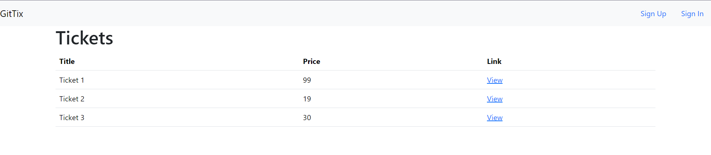
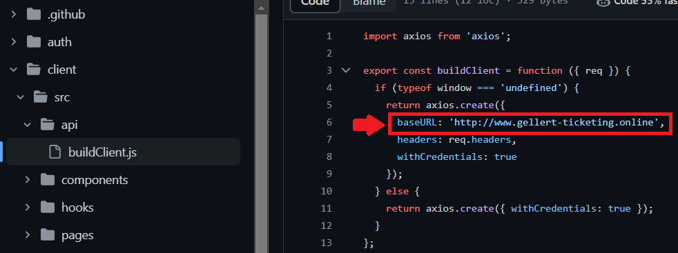

<a name="readme-top"></a>
<!-- PROJECT SHIELDS -->
<!--
*** I'm using markdown "reference style" links for readability.
*** Reference links are enclosed in brackets [ ] instead of parentheses ( ).
*** See the bottom of this document for the declaration of the reference variables
*** for contributors-url, forks-url, etc. This is an optional, concise syntax you may use.
*** https://www.markdownguide.org/basic-syntax/#reference-style-links
-->
<div align="center">
  <a href="https://github.com/csaszargellert/ticketing">
    
  </a>
  
</div>

<!-- TABLE OF CONTENTS -->
<details>
  <summary>Table of Contents</summary>
  <ol>
    <li>
      <a href="#about-the-project">About The Project</a>
      <ul>
        <li><a href="#built-with">Built With</a></li>
      </ul>
    </li>
    <li>
      <a href="#getting-started">Getting Started</a>
      <ul>
        <li><a href="#prerequisites">Prerequisites</a></li>
        <li><a href="#setup">Setup</a></li>
      </ul>
    </li>
    <li><a href="#contact">Contact</a></li>
    <li><a href="#acknowledgments">Acknowledgments</a></li>
  </ol>
</details>


<!-- ABOUT THE PROJECT -->
## About The Project

<a href="http://gellert-ticketing.online"></a>
<div aling="center">
  <h3 align="center">Ticketing</h3>
  
  <p>
    This website allows users to sell their unwanted tickets of concerts. Others can reserve tickets for 15 minutes and decide if they want to proceed with the purchase. Once reserved or purchased, the ticket is inaccessible, only the buyer can view it.
  </p>
  <p>
    The application is built with the concept of microservices.
  </p>
</div>

<p align="right">(<a href="#readme-top">back to top</a>)</p>


### Built With

* [![Next][Next.js]][Next-url]
* [![React][React.js]][React-url]
* [![Bootstrap][Bootstrap.com]][Bootstrap-url]
* [![Docker][Docker.com]][Docker-url]
* [![Kubernetes][Kubernetes.io]][Kubernetes-url]
* [![Typescript][Typescript.org]][Typescript-url]
* [![Express.js][Express.js]][Express-url]

<p align="right">(<a href="#readme-top">back to top</a>)</p>


<!-- GETTING STARTED -->
## Getting Started
### Prerequisites

* [Docker](https://www.docker.com/) installed
* [Kubernetes](https://kubernetes.io/) installed and a running cluster 
* [Skaffold](https://skaffold.dev/) installed
* [Stripe](https://stripe.com/) account

### Setup

1. Clone the repo
   ```sh
   git clone https://github.com/csaszargellert/ticketing.git
   ```
2. You need to have two secrets created in your kubernetes cluster
   * json-secret
     ```sh
     kubectl create secret generic json-secret --from-literal=JSON_WEB_TOKEN_KEY="<YOUR UNIQUE VALUE>"
     ```
   * stripe-secret
     ```sh
     kubectl create secret generic stripe-secret --from-literal=STRIPE_KEY="<YOUR STRIPE SECRET KEY>"
     ```
   <p>You can get your stripe secret key as shown below</p>
   
3. <p>Install <a href="https://kubernetes.github.io/ingress-nginx/deploy/">ingress-nginx</a> by selecting appropriate cluster</p>
   
4. <p>Change <a href="https://github.com/csaszargellert/ticketing/blob/master/client/src/pages/orders/%5BorderId%5D.js">stripe publishable key</a> in client folder</p>
   
5. <p>Change <a href="https://github.com/csaszargellert/ticketing/blob/master/client/src/api/buildClient.js">base url</a> in client folder to http://ingress-nginx-srv</p>
   
6. Add the following line at the end of *hosts* file:
   <br />
   **127.0.0.1 ticketing.dev**
   * <p>If you are on Windows, open notepad with administrator priviliges and go to C:\Windows\System32\drivers\etc\hosts</p>
     
   * If you are on Linux/MacOS, go to /etc/hosts
8. Initialize skaffold
   ```sh
   skaffold init
   ```
9. Start skaffold
   ```sh
   skaffold dev
   ```

<p align="right">(<a href="#readme-top">back to top</a>)</p>

<!-- USAGE -->
## Usage

You can signup with any madeup email account and password. 
<br />
<br />
***This application does not implement tls certificates therefore any request is sent over the internet as plain text!***
<br />
<br />
Stripe is only working in test mode.
<br />
<br />
**Card Number**: *4242 4242 4242 4242* 
<br />
**Expiration date**: *future date (ex: 10/27)*
<br />
**CVC**: *random 3-digit number (ex: 235)*
<br />


<!-- CONTACT -->
## Contact

Gellért Császár - [linkedin/csaszargellert](https://www.linkedin.com/in/gellert-csaszar/) - csaszargellert@gmail.com

Project Link: [https://github.com/csaszargellert/ticketing](https://github.com/csaszargellert/ticketing)

Live site: [gellert-ticketing.online](https://www.gellert-ticketing.online/)

<p align="right">(<a href="#readme-top">back to top</a>)</p>

<!-- ACKNOWLEDGMENTS -->
## Acknowledgments

* [Img Shields](https://shields.io)
* [Github Markdown Badges](https://github.com/Ileriayo/markdown-badges)
* [Github README template](https://github.com/othneildrew/Best-README-Template)

<p align="right">(<a href="#readme-top">back to top</a>)</p>


<!-- MARKDOWN LINKS & IMAGES -->
<!-- https://www.markdownguide.org/basic-syntax/#reference-style-links -->
[linkedin-shield]: https://img.shields.io/badge/-LinkedIn-black.svg?style=for-the-badge&logo=linkedin&colorB=555
[linkedin-url]: https://linkedin.com/in/csaszargellert
[product-screenshot]: images/screenshot.png
[Next.js]: https://img.shields.io/badge/next.js-000000?style=for-the-badge&logo=nextdotjs&logoColor=white
[Next-url]: https://nextjs.org/
[React.js]: https://img.shields.io/badge/React-20232A?style=for-the-badge&logo=react&logoColor=61DAFB
[React-url]: https://reactjs.org/
[Bootstrap.com]: https://img.shields.io/badge/Bootstrap-563D7C?style=for-the-badge&logo=bootstrap&logoColor=white
[Bootstrap-url]: https://getbootstrap.com
[Docker.com]: https://img.shields.io/badge/docker-%230db7ed.svg?style=for-the-badge&logo=docker&logoColor=white
[Docker-url]: https://www.docker.com/
[Kubernetes.io]: https://img.shields.io/badge/kubernetes-%23326ce5.svg?style=for-the-badge&logo=kubernetes&logoColor=white
[Kubernetes-url]: https://kubernetes.io/
[Typescript.org]: https://img.shields.io/badge/typescript-%23007ACC.svg?style=for-the-badge&logo=typescript&logoColor=white
[Typescript-url]: https://www.typescriptlang.org/
[Express.js]: https://img.shields.io/badge/express.js-%23404d59.svg?style=for-the-badge&logo=express&logoColor=%2361DAFB
[Express-url]: https://expressjs.com/
[product-screenshot]: images/main-page.png
